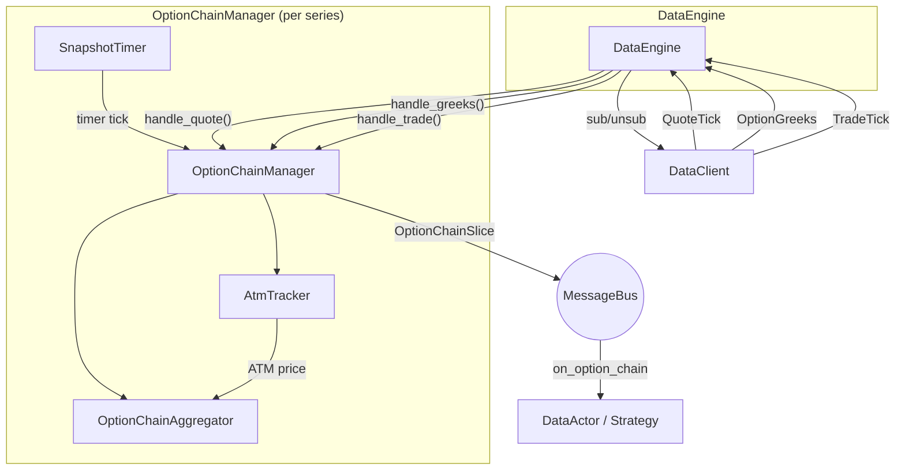

# Options

Nautilus provides first-class support for options trading across traditional
and crypto markets. This includes option-specific instrument types, venue-provided
Greeks streaming, option chain aggregation, and a local Black-Scholes Greeks calculator
for risk management.

## Option instrument types

The platform defines several option instrument types:

| Instrument           | Description                                                                  |
| -------------------- | ---------------------------------------------------------------------------- |
| `OptionContract`     | Exchange-traded option on an underlying with strike and expiry.              |
| `OptionSpread`       | Exchange-defined multi-leg option strategy as one line.                      |
| `CryptoOption`       | Crypto option with crypto quote/settlement; inverse or quanto style.         |
| `CryptoOptionSpread` | Crypto option spread with inverse, settlement currency, and fractional size. |
| `BinaryOption`       | Fixed-payout option that settles to 0 or 1.                                  |

Greeks-relevant metadata varies by instrument type:

- `OptionContract`, `CryptoOption`: full Greeks inputs including `strike_price`,
  `option_kind` (CALL/PUT), `expiration_ns`, `underlying`, `multiplier`.
- `OptionSpread`, `CryptoOptionSpread`: an exchange-defined multi-leg strategy
  published as a single tradable instrument. Has `underlying`, `expiration_ns`,
  and `strategy_type` (a venue-defined code). The spread itself carries no
  `strike_price` or `option_kind`; venue-provided leg details are stored in
  `info` when the adapter supplies them. Orders execute against the spread as
  one line. `CryptoOptionSpread` additionally carries `is_inverse` and
  `settlement_currency` for venues like Deribit.
- `BinaryOption`: has `expiration_ns` and `outcome`/`description`, but no
  `strike_price`, `option_kind`, or `underlying`.

## Subscribing to Greeks

Venues like Deribit, Bybit, and OKX publish real-time Greeks alongside their options markets.
Nautilus provides two subscription levels:

- **Per-instrument Greeks**: subscribe to individual option contracts.
- **Option chain slices**: subscribe to an aggregated view of an entire option series.

### Per-instrument Greeks

Subscribe to venue-provided Greeks for a single option contract from an actor or strategy:

```python
from nautilus_trader.model import ClientId

client_id = ClientId("DERIBIT")
self.subscribe_option_greeks(instrument_id, client_id=client_id)
```

Handle incoming updates by implementing the `on_option_greeks` handler:

```python
def on_option_greeks(self, greeks) -> None:
    self.log.info(
        f"{greeks.instrument_id}: "
        f"delta={greeks.delta:.4f} gamma={greeks.gamma:.6f} "
        f"vega={greeks.vega:.4f} theta={greeks.theta:.4f} "
        f"mark_iv={greeks.mark_iv} underlying={greeks.underlying_price}"
    )
```

To stop receiving updates:

```python
self.unsubscribe_option_greeks(instrument_id, client_id=client_id)
```

### Option chain subscriptions

An option chain subscription aggregates quotes and Greeks across all strikes in an
option series into `OptionChainSlice` snapshots. The `DataEngine` creates one Rust
`OptionChainManager` per series and owns the lifecycle: creating the manager, routing
incoming data, running snapshot timers, and draining wire subscription changes.

```python
from nautilus_trader.model import OptionSeriesId
from nautilus_trader.model import StrikeRange

series_id = OptionSeriesId(...)  # venue, underlying, settlement currency, expiry

# Subscribe to 5 strikes above and below ATM, snapshot every 1000ms
strike_range = StrikeRange.atm_relative(strikes_above=5, strikes_below=5)
self.subscribe_option_chain(
    series_id,
    strike_range=strike_range,
    snapshot_interval_ms=1000,
)
```

Handle snapshots by implementing the `on_option_chain` handler:

```python
def on_option_chain(self, chain) -> None:
    for strike in chain.strikes():
        call = chain.get_call(strike)
        put = chain.get_put(strike)
        if call and call.greeks:
            self.log.info(f"Call {strike}: delta={call.greeks.delta:.4f}")
```

### ATM-relative access

`get_call_atm_offset` / `get_put_atm_offset` step **quoted** strikes in
`chain.strikes()`. `get_call_listed_offset` / `get_put_listed_offset` step the
catalog in `chain.listed_strikes()` (the same ladder `StrikeRange.atm_relative`
uses), then `get_call` / `get_put`. `0` is ATM, positive offsets are higher
strikes, negative are lower. A missing quote returns `None`; the helper does
not walk to the next quoted strike.

```python
def on_option_chain(self, chain) -> None:
    atm_call = chain.get_call_listed_offset(0)
    otm_call = chain.get_call_listed_offset(1)  # listed C[+1]
    otm_put = chain.get_put_listed_offset(-1)  # listed P[-1]
```

Quoted helpers return `None` for every offset while `atm_strike` has no row in
`strikes()`. Listed helpers still step the catalog in that case.

:::warning
`get_call_listed_offset(2)` is two catalog steps from cache at subscribe, not a
fixed price distance. Load the full series when moneyness matters.
:::

### Last-trade ATM

By default ATM comes from option Greeks `underlying_price`. Pass
`atm_instrument_id` to drive ATM and strike-window rebalance from that
instrument's last trade instead (equity or index, for example `SPY.ARCA` or
`NIFTY.NSE`). The engine then skips the HTTP reference-price request and the
one-sample Greeks bootstrap, and subscribes that instrument's trades through
the client routed for **its venue**. The chain's `client_id` is not used for
that stream. Last-trade ATM does not require `include_greeks=False`; Greeks on
the rows are a separate wire.

:::warning
Last-trade ATM resolves the ATM instrument's client by **venue routing only**.
A default-routing client is not used. Venue-less adapters (Databento,
Interactive Brokers, Tardis) need explicit venue routing before this subscribe
succeeds:

```python
RoutingConfig(venues=["ARCA", "OPRA"])  # `default=True` alone is not enough
```

Without it the subscribe logs an error and no chain is created. In a backtest
the `BACKTEST` client already satisfies this gate.
:::

Several series may share the same ATM instrument; unsubscribing one series does
not drop the last-trade stream while another series or an explicit
`subscribe_trades` still listens. `reset`, `stop`, and `dispose` tear managers
down and release ATM trades that no remaining subscriber wants.

Set `include_greeks=False` to skip per-strike option Greeks (rows still need
quotes, then `greeks = None`). Leave the default `True` on venues that publish
Greeks. If Greeks are off, an ATM-based range still needs an ATM source. The
engine logs an error and creates no chain; `subscribe_option_chain` still
returns normally, so watch the log:

- `StrikeRange.delta(...)` with `include_greeks=False`.
- An ATM-based `StrikeRange` with `include_greeks=False` and no
  `atm_instrument_id`.
- `atm_instrument_id` on a venue with no routing entry (see the warning above).

A fixed strike range can use `include_greeks=False` without last-trade ATM.
Equity books typically pass both `atm_instrument_id` and `include_greeks=False`.

```python
from nautilus_trader.model import InstrumentId
from nautilus_trader.model import OptionSeriesId
from nautilus_trader.model import StrikeRange

series_id = OptionSeriesId.from_option_contract(contract)
self.subscribe_option_chain(
    series_id,
    strike_range=StrikeRange.atm_relative(10, 10),
    snapshot_interval_ms=1000,
    atm_instrument_id=InstrumentId.from_str("SPY.ARCA"),
    include_greeks=False,
)
```

A last trade is spot, not the venue forward used on the Greeks path. Prefer
Greeks or a synthetic forward for longer-dated equity series where carry can
move ATM by more than one strike. Pair last-trade ATM with a snapshot interval;
raw mode publishes a slice on every price-changing print.

Python accepts `atm_instrument_id` and `include_greeks` as keyword arguments on
`subscribe_option_chain`. Rust keeps the original five-argument
`subscribe_option_chain` and uses `subscribe_option_chain_with` (or
`SubscribeOptionChain::with_atm_instrument_id` / `with_include_greeks`) for the
extras. Slice fields are documented under [OptionChainSlice](#optionchainslice-data-type).

### Strike range filtering

`StrikeRange` controls which strikes are active in a chain subscription:

| Variant       | Description                                         | Example                          |
| ------------- | --------------------------------------------------- | -------------------------------- |
| `Fixed`       | Subscribe to an explicit set of strikes.            | `StrikeRange.fixed([...])`       |
| `AtmRelative` | N strikes above and N below the current ATM strike. | `StrikeRange.atm_relative(5, 5)` |
| `AtmPercent`  | All strikes within a percentage band around ATM.    | `StrikeRange.atm_percent(0.10)`  |
| `Delta`       | Strikes whose call or put delta is near a target.   | `StrikeRange.delta(0.25, 0.05)`  |

For dynamic strike ranges, subscriptions are deferred until the ATM price is determined.
ATM is derived from the venue reference price in `OptionGreeks.underlying_price`. It can
also be seeded from a reference price fetched for the option series via HTTP, allowing
instant bootstrap before live WebSocket ticks arrive. As ATM shifts, the active strike
set rebalances automatically.

`Delta` resolves from venue-provided Greeks: a strike is active when its call or put delta
magnitude (calls positive, puts negative, compared by absolute value) falls within
`tolerance` of `target`. A typical out-of-the-money target such as `0.25` selects a strike on
each side of ATM. Before the ATM reference price is known, `Delta` is deferred like other
dynamic ranges. After ATM is known, when no active strike's Greeks match the band
(including before any Greeks arrive), `Delta` falls back to an ATM-relative window of five
strikes either side of ATM. Before switching from the fallback window to selected delta
strikes, the aggregator waits until every fallback leg has Greeks so partial early updates do
not drop neighboring strikes.

### Snapshot vs. raw mode

The `snapshot_interval_ms` parameter controls publishing behavior:

- **Snapshot mode** (`snapshot_interval_ms=1000`): Quotes and Greeks accumulate in a
  buffer and publish as an `OptionChainSlice` on a timer. Suitable for periodic
  portfolio rebalancing or UI display.
- **Raw mode** (`snapshot_interval_ms=None`): Each quote or Greeks update for an
  active instrument publishes a slice immediately. Suitable for latency-sensitive
  strategies that react to individual updates.

## Backtesting option chains

Option-chain backtests use the same `OptionChainManager` and `OptionChainAggregator`
path as live subscriptions. The catalog must already contain the option
instruments and the streams the chosen ATM source needs.

**Last-trade ATM (equity / index, no venue Greeks):** `QuoteTick` for the option
contracts you replay, `TradeTick` for the ATM instrument (for example `SPY.ARCA`
or `NIFTY.NSE`), and `OptionContract` definitions. Subscribe with
`atm_instrument_id` as shown above. Pass `include_greeks=False` to skip the
per-strike Greeks wire. Do not add an `OptionGreeks` data config. Spot and
options are usually different venues, so the run needs both (for example OPRA
and ARCA).

`BacktestNode` registers instruments that appear on a data config. A neighborhood
quote tape therefore loads only those names into cache. `resolve_instruments`
runs once at subscribe, so ATM "nearest listed strike" is nearest among
**cached** contracts. Extra series definitions must be on the engine before
subscribe (`BacktestEngine.add_instrument`, or `BacktestNode.add_instrument`
after `build`) without binding extra quote files.

**Greeks / forward ATM (crypto venues):** `QuoteTick` and `OptionGreeks` for
each option, plus the option instruments. ATM comes from `underlying_price`.
Tardis replays satisfy this when book/quotes are `QuoteTick` and
`option_summary` is `OptionGreeks`.

Last-trade catalog data:

```python
data = [
    BacktestDataConfig(
        data_type="QuoteTick",
        catalog_path="/path/to/catalog",
        instrument_ids=option_instrument_ids,
    ),
    BacktestDataConfig(
        data_type="TradeTick",
        catalog_path="/path/to/catalog",
        instrument_ids=[InstrumentId.from_str("SPY.ARCA")],
    ),
]
```

Greeks catalog data:

```python
data = [
    BacktestDataConfig(
        data_type="QuoteTick",
        catalog_path="/path/to/catalog",
        instrument_ids=option_instrument_ids,
    ),
    BacktestDataConfig(
        data_type="OptionGreeks",
        catalog_path="/path/to/catalog",
        instrument_ids=option_instrument_ids,
    ),
]
```

Then subscribe from the strategy:

```python
strike_range = StrikeRange.delta(0.25, 0.05)
self.subscribe_option_chain(
    series_id,
    strike_range=strike_range,
    snapshot_interval_ms=1000,
)
```

Use `snapshot_interval_ms=None` for raw mode. Raw mode publishes a slice after each
quote or Greeks update for an active instrument. Use an integer interval for
thinned snapshots. Thinned mode accumulates the latest BBO and Greeks per instrument
and publishes the chain on the timer cadence, reducing event volume for large chains.

Each `OptionChainSlice` joins the latest BBO and optional Greeks by instrument,
then groups the result by strike and option kind. With `include_greeks=False`,
every row has `greeks = None`. ATM is the last trade when `atm_instrument_id` is
set. Otherwise it is a `Fixed` range, or Greeks `underlying_price` when Greeks
remain on. With Greeks enabled, a quote can arrive before Greeks and the reverse;
the aggregator keeps latest state and attaches both when available.

Selection can happen either in the subscription range or inside the strategy:

- Moneyness: use `StrikeRange.atm_relative(...)` or `StrikeRange.atm_percent(...)`.
- Delta: use `StrikeRange.delta(target, tolerance)`, or inspect `entry.greeks.delta`
  in `on_option_chain`.
- Strike: use `StrikeRange.fixed([...])`, or read `chain.get_call(strike)` and
  `chain.get_put(strike)`.

Matching is quote-driven for options. Market orders and marketable limits fill as
takers against the opposing replayed BBO. Passive limit orders rest on the simulated
book and can fill as makers when later BBO updates trade through the limit price.
The model does not simulate L2 queue position for options.

Structural option fee models are configured on the simulated venue, not inferred
from the venue name:

```python
from decimal import Decimal

from nautilus_trader.execution import CappedOptionFeeModel
from nautilus_trader.execution import TieredNotionalOptionFeeModel

deribit_like = CappedOptionFeeModel(
    maker_rate=Decimal("0.0003"),
    taker_rate=Decimal("0.0003"),
)
okx_like = TieredNotionalOptionFeeModel(
    maker_rate=Decimal("0.0002"),
    taker_rate=Decimal("0.0005"),
)
```

Pass one of these objects as `fee_model` on `BacktestVenueConfig`. The Rust surface
uses `FeeModelAny::CappedOption(CappedOptionFeeModel::new(...))` and
`FeeModelAny::TieredNotionalOption(TieredNotionalOptionFeeModel::new(...))`.

See `examples/backtest/tardis_option_chain.py` and the Rust `tardis-option-chain`
example in `crates/backtest/examples/`.

## Option chain architecture

The option chain system is event-driven and built around per-series isolation. The
`DataEngine` creates one Rust `OptionChainManager` per subscribed option series. The
manager wraps `OptionChainAggregator` and `AtmTracker`, registers message bus handlers,
publishes snapshots, and queues wire subscription changes for the engine to drain.



### Component responsibilities

#### DataEngine

Holds one `OptionChainManager` per active `OptionSeriesId`. On
`SubscribeOptionChain`, it resolves instruments from the cache (that set is the
listed ladder), skips the HTTP reference-price request when `atm_instrument_id`
is set, otherwise requests a series reference price for dynamic strike ranges,
creates the manager, subscribes active instruments to the data client, and sets
up the snapshot timer. On each timer tick, the manager checks for rebalances,
publishes a snapshot, and queues any wire subscription changes for the engine to
drain. On `UnsubscribeOptionChain` or when all instruments expire, it tears down
the manager, cancels the timer, and
unsubscribes wire-level feeds.

#### OptionChainManager

A per-series Rust manager around `OptionChainAggregator` and `AtmTracker`. The
`DataEngine` feeds it market data through `handle_quote()`, `handle_greeks()`, and
`handle_trade()` (last-trade ATM). In snapshot mode, timer callbacks call
`publish_slice()`. In raw mode, each active quote, Greeks, or ATM last-trade
update can call `publish_slice()` immediately. Empty slices are not published.
The manager bootstraps the active instrument set internally on the first ATM price.

#### OptionChainAggregator

Accumulates quotes and Greeks into call/put buffers using keep-latest semantics.
Instruments that did not update since the last snapshot are still included. Greeks
that arrive before any quote for an instrument are held in a `pending_greeks`
buffer and attached when the first quote arrives. On each `snapshot()` call, the
aggregator produces an immutable `OptionChainSlice`.

#### AtmTracker

Derives the ATM price from venue Greeks `underlying_price` (default) or a
configured instrument's last trade. Last-trade mode ignores Greeks forwards.
The Greeks path can be pre-seeded from an HTTP reference price for the option
series, allowing instant bootstrap without waiting for WebSocket ticks.

### Bootstrap and rebalancing

For dynamic strike ranges (`AtmRelative`, `AtmPercent`, and `Delta`), the active
instrument set cannot be determined until the ATM price is known.

**Last-trade ATM:**

1. Subscribe with `atm_instrument_id`. The engine does not request an HTTP reference price.
2. The manager reads cache for that instrument's last trade if one exists, then
   listens on its trade topic (routed by that instrument's venue).
3. The first last trade bootstraps the active window. Raw mode can publish on
   that trade; an empty slice (no option quotes yet) is skipped.

**Instant bootstrap (reference price available):**

1. `DataEngine` receives `SubscribeOptionChain`, resolves all instruments for the
   series from the cache, and requests a reference price from the data client.
2. When the reference price response arrives, the engine creates the manager with
   the ATM price pre-seeded. The manager computes the active strike set during
   construction.
3. The engine subscribes the active instruments immediately.

**Deferred bootstrap (no reference price):**

1. The engine has no matching client or cached option instrument, the client reports no
   reference price, the request fails, or the request times out after 30 seconds.
2. The engine creates the manager with no initial ATM price. The active set is
   empty. When the request reached a client with a cached sample option, the engine
   subscribes that sample's Greeks as the bootstrap source. Without a client or sample,
   bootstrap still depends on relevant Greeks data already flowing from another
   subscription.
3. When the engine feeds an `OptionGreeks` event with `underlying_price` through
   `handle_greeks()`, the manager bootstraps the active instrument set, registers
   message bus handlers, and queues the new wire subscriptions for the engine to
   drain. The sample subscription becomes part of the active set or is released.

Once bootstrapped, the aggregator monitors ATM drift. On each snapshot timer tick,
the manager calls the aggregator's `check_rebalance()` which returns any instruments
to add or remove. A hysteresis threshold and cooldown period prevent thrashing near
strike boundaries.

## OptionGreeks data type

`OptionGreeks` carries venue-provided sensitivities and implied volatility for a
single option contract:

| Field              | Type               | Description                                         |
| ------------------ | ------------------ | --------------------------------------------------- |
| `instrument_id`    | `InstrumentId`     | The option contract these Greeks apply to.          |
| `convention`       | `GreeksConvention` | Numeraire convention for the Greeks.                |
| `delta`            | `float`            | Rate of change of option price per unit underlying. |
| `gamma`            | `float`            | Rate of change of delta per unit underlying.        |
| `vega`             | `float`            | Venue-reported vega.                                |
| `theta`            | `float`            | Venue-reported theta.                               |
| `rho`              | `float`            | Venue-reported rho; defaults to zero.               |
| `mark_iv`          | `float` or None    | Mark implied volatility.                            |
| `bid_iv`           | `float` or None    | Bid implied volatility.                             |
| `ask_iv`           | `float` or None    | Ask implied volatility.                             |
| `underlying_price` | `float` or None    | Underlying price at time of calculation.            |
| `open_interest`    | `float` or None    | Open interest for the contract.                     |
| `ts_event`         | `int`              | UNIX timestamp (nanoseconds) of the event.          |
| `ts_init`          | `int`              | UNIX timestamp (nanoseconds) when initialized.      |

## OptionChainSlice data type

`OptionChainSlice` is a point-in-time snapshot of an entire option series.

Properties:

| Property            | Type                   | Description                                                         |
| ------------------- | ---------------------- | ------------------------------------------------------------------- |
| `series_id`         | `OptionSeriesId`       | Option expiry key (not the ATM instrument).                         |
| `atm_strike`        | `Price` or None        | Closest listed strike to `atm_price` among cached series contracts. |
| `atm_price`         | `Price` or None        | Tracker price (last trade or Greeks/HTTP reference).                |
| `atm_instrument_id` | `InstrumentId` or None | Set in last-trade mode; `None` on the Greeks/reference path.        |
| `ts_event`          | `int`                  | UNIX timestamp (nanoseconds).                                       |
| `ts_init`           | `int`                  | UNIX timestamp (nanoseconds).                                       |

Call and put data are accessed through methods, not as direct properties.
Each `OptionStrikeData` returned by these methods contains a `quote` (`QuoteTick`)
and an optional `greeks` (`OptionGreeks`) for that strike.

Methods:

- `strikes()`: quoted strikes in this snapshot (not the full listed series).
- `listed_strikes()`: catalog strikes stamped at snapshot (same ladder as `StrikeRange.atm_relative`).
- `strike_count()`, `call_count()`, `put_count()`: counts.
- `get_call(strike)`, `get_put(strike)`: full `OptionStrikeData`.
- `get_call_greeks(strike)`, `get_put_greeks(strike)`: Greeks only (`None` when `include_greeks=False`).
- `get_call_quote(strike)`, `get_put_quote(strike)`: quote only.
- `get_call_atm_offset(n)`, `get_put_atm_offset(n)`: quoted-slice offsets; not listed OCC steps.
- `get_call_listed_offset(n)`, `get_put_listed_offset(n)`: catalog C[+N] / P[-N]; `None` if that listed strike has no quote.
- `is_empty()`: true if the chain has no quoted rows (empty slices are not published).

## Adapter support

The following adapters currently support option Greeks subscriptions.
Last-trade ATM (`atm_instrument_id`) does not need venue Greeks; it needs a
trade stream for the ATM instrument and option quotes. Pass
`include_greeks=False` to skip the Greeks wire when the venue has none.

| Adapter | Per-instrument Greeks | Option chains |
| ------- | :-------------------: | :-----------: |
| Deribit | ✓                     | ✓             |
| Bybit   | ✓                     | ✓             |
| OKX     | ✓                     | -             |

## See also

- [Greeks](greeks.md) - Local Greeks calculation and portfolio risk management.
- [Data](data/) - Built-in data types and the subscription model.
- [Actors](actors.md) - Subscription and handler reference table.
